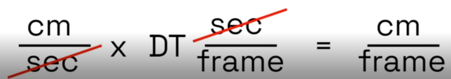

# Shooter

## DeltaTime

1. DeltaTime : the time between frames
2. Frame : a single image updaated to the screen
3. FrameRate : number of frames updated per second (FPS)
4. Tick : synonymous with frame

# TPS_Demo
